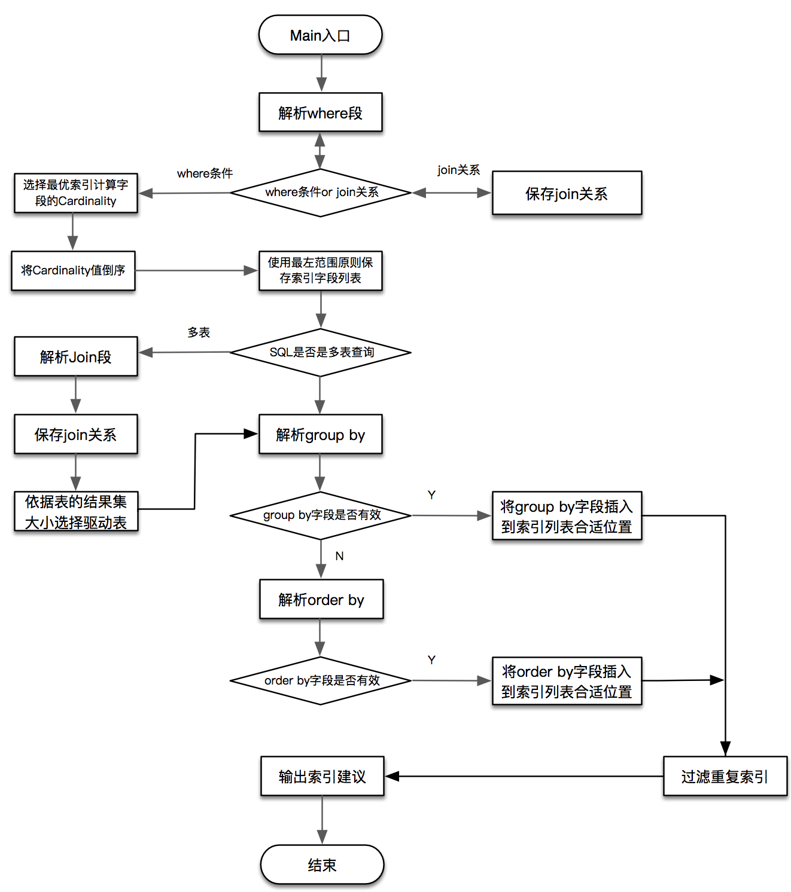
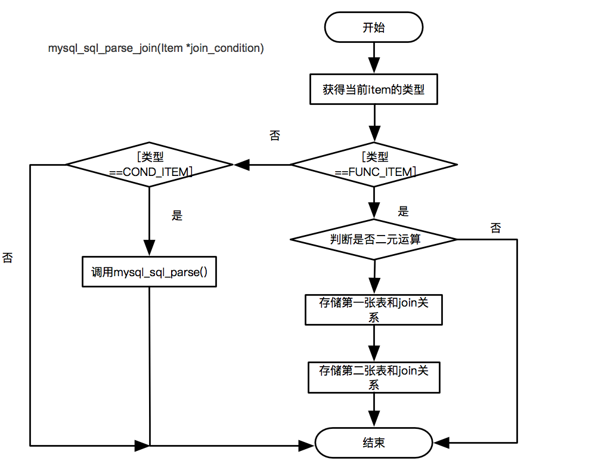
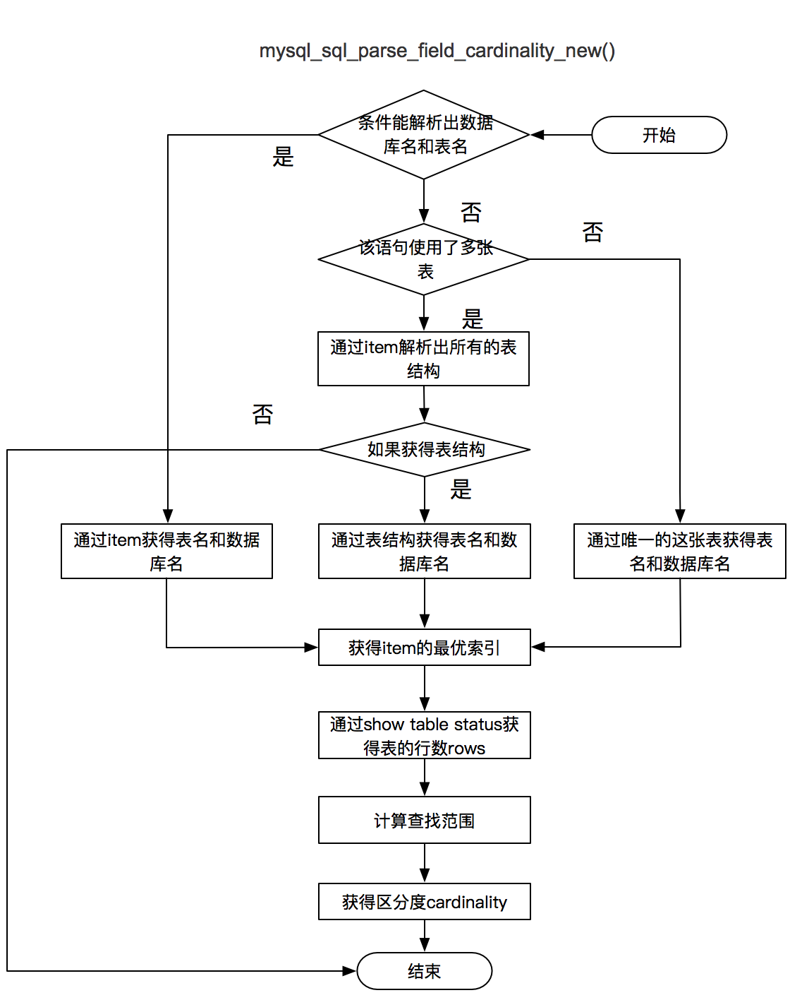
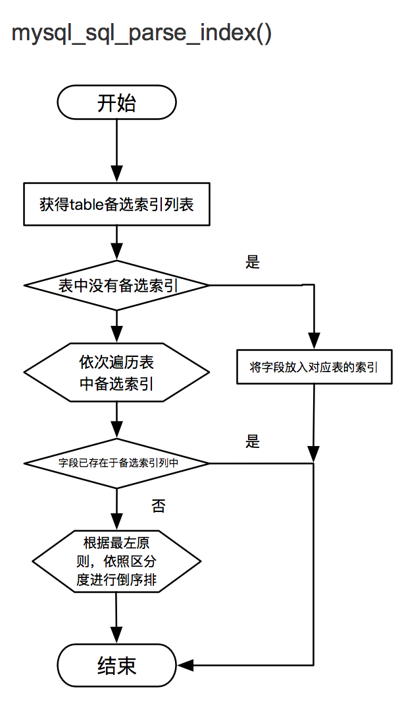
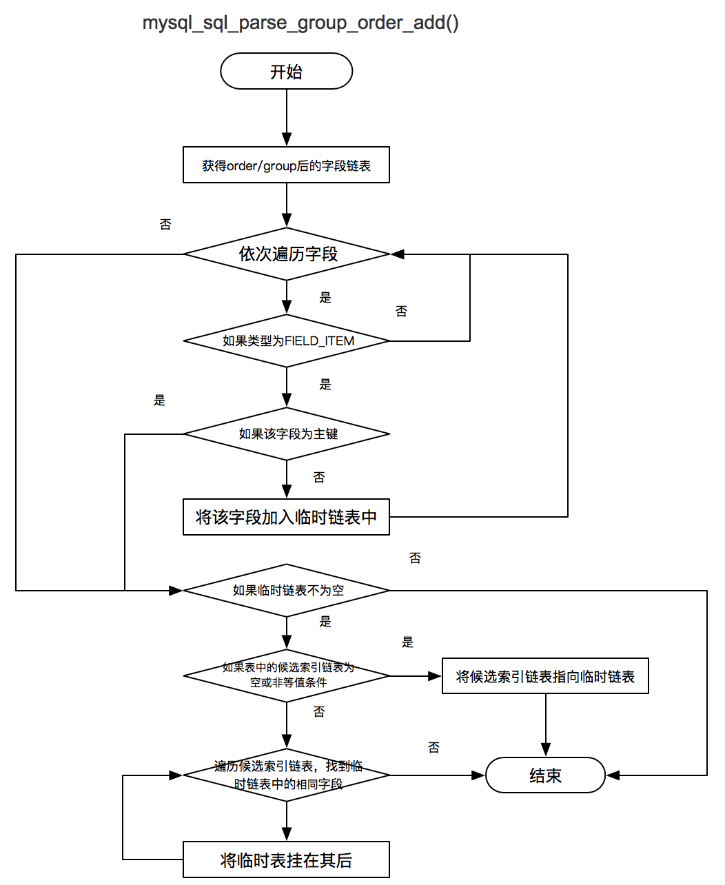
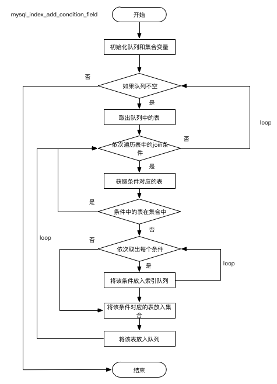
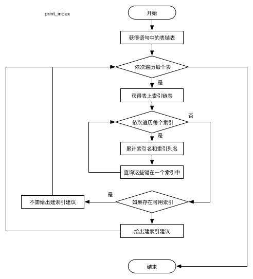

### 1 介绍
在数据库运维过程中，优化SQL是业务团队与DBA团队的日常任务。例行SQL优化，不仅可以提升程序性能，还能够降低线上故障的概率。

目前常用的SQL优化方式包括但不限于：业务层优化、SQL逻辑优化、索引优化等。其中索引优化通常通过调整索引或新增索引从而达到SQL优化的目的。索引优化往往可以在短时间内产生非常巨大的效果。如果能够将索引优化转化成工具化、标准化的流程，减少人工介入的工作量，无疑会大大提高DBA的工作效率

SQLAdvisor是由美团点评公司DBA团队(北京)开发维护的SQL优化工具：**输入SQL，输出索引优化建议**。 它基于MySQL原生词法解析，再结合SQL中的where条件以及字段选择度、聚合条件、多表Join关系等最终输出最优的索引优化建议。目前SQLAdvisor在公司内部大量使用，较为成熟、稳定。

美团点评致力于将SQLAdvisor打造成一款高智能化SQL优化工具，选择将已经在公司内部使用较为成熟的、稳定的SQLAdvisor项目开源，[github地址](ttps://github.com/Meituan-Dianping/SQLAdvisor)。希望与业内有类似需求的团队，一起打造一款优秀的SQL优化产品。

**SQLAdvisor架构流程图**：

### 2 解析树分解
#### 2.1 join 处理
1. join语法分为两种：join on  和 join using。并且join on 有时会存在where条件中。
2. 分析Join条件首先会得到一个nested_join的table list,通过判断它的join_using_fields 字段是否为空来区分Join on 与Join using。
3. 生成的table list 以二叉树的形式进行存储，以后序遍历的方式对二叉树进行遍历。
4. 生成内部解析树时，right join 会转换成 left Join
5. join条件会存在当层的叶子节点上，如果左右节点都是叶子节点，会存在右叶子节点
6. 每一个非叶子节点代表一次Join的结果。     

上述实现时，涉及的函数为：mysql_sql_parse_join(TABLE_LIST *join_table)   mysql_sql_parse_join(Item *join_condition)  ，主要流程图如下：

#### 2.2 where 处理
1. 主要是提取sql语句的where条件。where条件中一般由AND 和 OR 连接符进行连接，因为OR 比较难以处理，所以忽略，只处理and连接符。
2. 由于where 条件中可以存在 join条件，因此需要进行区分。
3. 依次获取where条件，当条件中的操作符是like, 如果不是前缀匹配则丢弃这个条件。
4. 根据条件计算字段的区分度按照高低进行倒序排，如果小于30则丢弃。同时使用最左原则将where条件进行有序排列。

#### 2.3 计算区分度
##### 区分度计算方法为
1. 通过“show table status like”获得表的总行数table_count。
2. 通过计算选择表中已存在的区分度最高的索引best_index，同时Primary key > Unique key > 一般索引
3. 通过计算获取数据采样的起始值offset与采样范围rand_rows：
    1. offset = (table_count / 2) > 10W ? 10W : (table_count / 2)
    2. rand_rows =(table_count / 2) > 1W ? 1W : (table_count / 2)
    3. 使用select count(1) from (select field from table force index(best_index) order by cl.. desc limit rand_rows) where field_print 得到满足条件的rows。
    4. cardinality = rows == 0 ? rand_rows : rand_rows / rows;
    5. 计算完成选择度后，会根据选择度大小，将该条件添加到该表中的备选索引中。

主要涉及的函数为：mysql_sql_parse_field_cardinality_new() 计算选择度

#### 2.4 添加备选索引
1. mysql_sql_parse_index()将条件按照选择度添加到备选索引链表中
2. 上述两函数的流程图如下所示：

#### 2.5 group 与 order 处理
1. group 字段与order 字段能否用上索引，需要满足如下条件
    1. 涉及到的字段必须来自于同一张表，并且这张表必须是确定下来的驱动表
    2. group by 优于 Order by， 两者只能同时存在一个。
    3. order by 字段的排序方向必须完全一致，否则丢弃整个Order by 字段列。
    4. 当order by 条件中包含主键时，如果主键字段为 order by 字段列末尾，忽略该主键，否则丢弃整个Order by 字段列
2. 整个索引列排序优先级：等值>(group by | order by )> 非等值
3. 该过程中设计的函数主要有：
    1. mysql_sql_parse_group() 判断group后的字段是否均来自于同一张表
    2. mysql_sql_parse_order() 判断order后的条件是否可以使用
    3. mysql_sql_parse_group_order_add() 将字段依次按照规则添加到备选索引链表中

### 3 驱动表选择
1. 经过前期的where解析、join解析，已经将SQL中表关联关系存储起来，并且按照一定逻辑将侯选驱动表确定下来
2. 在侯选驱动表中，按照每一张表的侯选索引字段中第一个字段进行计算表中结果集大小
3. 使用explain select * from table where field 来计算表中结果集
4. 结果集小最小的被确为驱动表。
5. 步骤中涉及的函数为：final_table_drived()，在该函数中，调用了函数get_join_table_result_set()来获取每张驱动候选表的行数。

### 4 添加被驱动表备选索引
1. 通过上述过程，已经选择了驱动表，也通过解析保存了语句中的条件。
2. 由于选定了驱动表，因此需要对被驱动表的索引，根据join条件进行添加。
3. 该过程涉及的函数主要是：mysql_index_add_condition_field()，流程如下：

### 5 输出建议
1. 通过上述步骤，已经将每张表的备选索引键全部保存。此时，只要判断每张表中的候选索引键是否在实际表中已存在。没有索引，则给出建议增加对应的索引。
2. 该步骤涉及的函数是：print_index() ，主要的流程图为：

